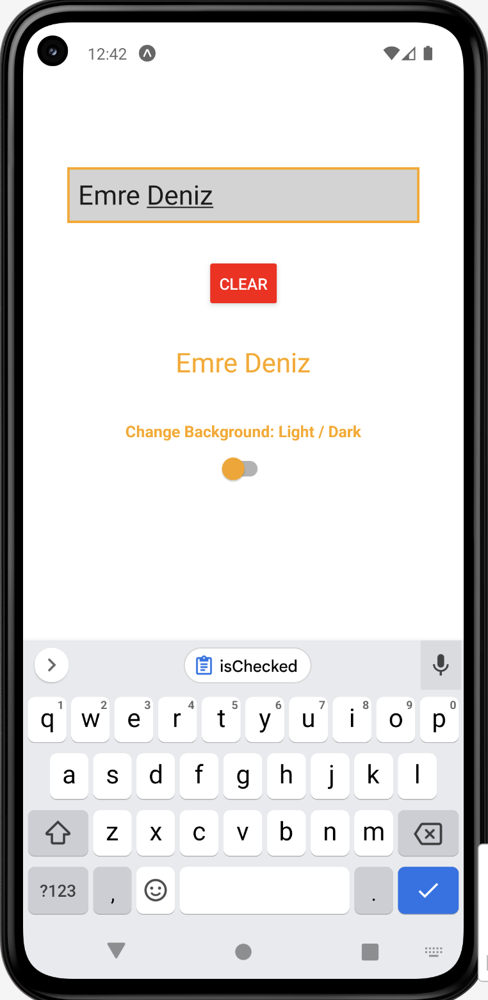
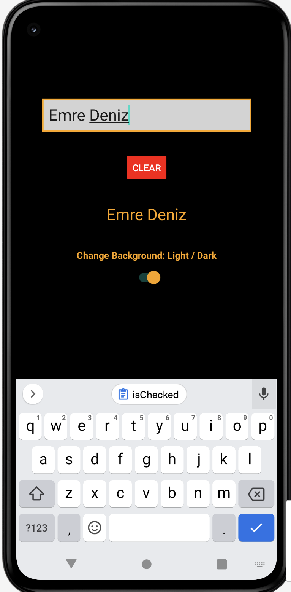

# React-Native-Lab_2
React Native Basic App

### HOW TO RUN:
```console
npm install
npx expo start
```

### DESCRIPTIONS:
Features:
1. Takes input from the TextInput and displays it in the Text component below
2. Add button that clears the content of the field
3. Add Switch that will change the background color of your app between white and dark.

### SCREENSHOTS:
<kbd></kbd>    <kbd></kbd>
